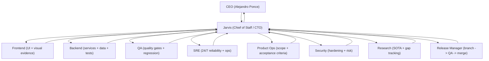

# PonceBot (codexbot) - Jarvis CTO 24/7

PonceBot turns a Linux server into a Telegram-first engineering org:

- You message the bot.
- **Jarvis** (Chief of Staff / CTO) decides if it's a **query** (answer directly) or **work** (delegate in parallel).
- You get a **single editable ticket card** (no spam) plus a final executive wrap-up with artifacts (patches, logs, PNGs).

This repository prioritizes:
- CEO-grade UX in Telegram
- 24/7 operation (systemd)
- Multi-agent orchestration (roles + worktrees + sessions)
- Safety-by-default (secrets out of git; approvals for dangerous modes)

## Org Chart (Jarvis v1)



## Ground Truth vs Assumptions

Ground truth (implemented in this repo):
- Telegram bot entrypoint in `bot.py`.
- Orchestrator with persistent SQLite queue in `./data/jobs.sqlite`.
- Multi-agent roster and prompts in `orchestrator/agents.yaml` (supports `{CEO_NAME}` placeholder).
- Runbooks (scheduled autonomous checks) in `orchestrator/runbooks.yaml`.
- Per-role worktrees (isolated workspaces) under `BOT_WORKTREE_ROOT` (default: `./data/worktrees`).
- Per-role Codex sessions (`codex exec resume`) when `BOT_ORCH_SESSIONS_ENABLED=1`.
- "No spam" policy: single editable **ticket card** per top-level request, plus `/watch` single live status message.
- Voice-in transcription supports `whisper.cpp` (local) and OpenAI (paid) backends.
- Screenshot pipeline can send PNG artifacts (Playwright optional; can be disabled).

Assumptions (deployment-specific; validate on your server):
- Outbound Internet access (Telegram polling to `api.telegram.org:443`, plus optional GitHub/Playwright).
- `codex` CLI is installed and configured (`codex --version` works).
- If voice-in is enabled: `ffmpeg` + `whisper-cli` + a GGML model are installed.
- If screenshots are enabled: Playwright + Chromium are installed and runnable on the host.

## What You Notice in Telegram (CEO UX)

1. **Jarvis is the front door**
- Any plain message routes to Jarvis.
- Only explicit markers route to others: `@frontend`, `@backend`, `@qa`, `@sre`, etc.

2. **No spam**
- One ticket card message is created per top-level request.
- The bot edits that message as the ticket progresses.
- Use `/watch` for a single live "company status" message (auto-updated).

3. **Deterministic CEO queries (no Codex, no delegation)**
- "Who am I?"
- "How many employees/agents do we have?"
- "What models do agents use?"
- "What is SRE?"

## Quick Start

1. Create a Telegram bot with `@BotFather`.
2. Create config:

```bash
cp codexbot.env.example codexbot.env
```

3. Store secrets outside the repo (recommended):

```bash
mkdir -p ~/.config/codexbot
cat > ~/.config/codexbot/secrets.env <<'EOF'
TELEGRAM_BOT_TOKEN=123456789:REPLACE_ME
EOF
chmod 600 ~/.config/codexbot/secrets.env
```

4. Set allow-lists (required). Message the bot once to see your ids, then set:
- `TELEGRAM_ALLOWED_USER_IDS=...` and/or `TELEGRAM_ALLOWED_CHAT_IDS=...`

5. Run:

```bash
ENV_LOCAL_FILE="$HOME/.config/codexbot/secrets.env" ./run.sh
```

For 24/7 operation with systemd, see `systemd/INSTALL.md`.

## CEO Commands (Cheat Sheet)

- `/help` (full command list)
- `/whoami` (show ids)
- `/agents` (role backlog + running)
- `/ticket <id>` (ticket tree: parent -> children)
- `/job <id>` (job details + artifacts)
- `/watch` / `/unwatch` (single live status message)
- `/orders` (autopilot scope: active CEO orders)
- `/order show|pause|done <id>` (manage orders)
- `/snapshot <url|goal>` (frontend visual work)
- `/approve <id>` (unblock blocked jobs)
- `/pause <role>` / `/resume <role>` (role controls)
- `/emergency_stop` / `/emergency_resume` (global stop/resume)

## Autopilot (24/7 Within CEO Orders)

Goal: keep employees busy only on active CEO orders.

Grounded behavior:
- Top-level Jarvis tickets are persisted as **orders** in SQLite (`ceo_orders`).
- Autopilot ticks every 15 minutes and can enqueue Jarvis follow-up work when an order is idle.
- Use `/orders` to see what autopilot considers in-scope.

## Agent Roster (Source of Truth)

Edit `orchestrator/agents.yaml`:
- role profiles (model, effort, default mode, parallelism)
- prompts and reporting rules

If your Codex CLI does not support `gpt-5.2`, change the `model:` fields accordingly.

## CEO Name (Prompts)

Set `BOT_CEO_NAME` (default: `"Alejandro Ponce"`).

In YAML prompts, use `{CEO_NAME}` and the bot will render it at runtime.

## Safety Notes

- Keep secrets out of git and out of `CODEX_WORKDIR` when possible.
- Default sandbox mode is read-only; `rw` allows writing inside worktrees; `full` is dangerous.
- You can enable "minimal limitations" by setting:
  - `CODEX_DANGEROUS_BYPASS_SANDBOX=1` (EXTREMELY DANGEROUS; prefer external sandboxing like a VM).

## OpenClaw Gap Notes (todo)

This repo is optimized for Telegram-first CEO UX and a minimal control plane (ticket cards + `/watch`).
After a direct code read of OpenClaw, document the main gaps and highest ROI next steps here.
