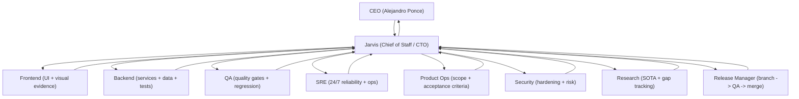

# PonceBot (codexbot) - Jarvis CTO 24/7

PonceBot turns a Linux server into a Telegram-first engineering org:

- You message the bot.
- **Jarvis** (Chief of Staff / CTO) decides if it's a **query** (answer directly) or **work** (delegate in parallel).
- You get a **single editable ticket card** (no spam) plus a final executive wrap-up with artifacts (patches, logs, PNGs).

This repository prioritizes:
- CEO-grade UX in Telegram
- 24/7 operation (systemd)
- Multi-agent orchestration (roles + worktrees + sessions)
- Safety-by-default (secrets out of git; approvals for dangerous modes)

## Org Chart (Jarvis v1)


```mermaid
flowchart TB
  CEO["CEO (Alejandro Ponce)"] --> J["Jarvis (Chief of Staff / CTO)"]
  J --> FE["Frontend (UI + visual evidence)"]
  J --> BE["Backend (services + data + tests)"]
  J --> QA["QA (quality gates + regression)"]
  J --> SRE["SRE (24/7 reliability + ops)"]
  J --> PO["Product Ops (scope + acceptance criteria)"]
  J --> SEC["Security (hardening + risk)"]
  J --> RES["Research (SOTA + gap tracking)"]
  J --> RM["Release Manager (branch -> QA -> merge)"]
  FE --> J
  BE --> J
  QA --> J
  SRE --> J
  PO --> J
  SEC --> J
  RES --> J
  RM --> J
  J --> CEO
```

## Ground Truth vs Assumptions

Ground truth (implemented in this repo):
- Telegram bot entrypoint in `bot.py`.
- Orchestrator with persistent SQLite queue in `./data/jobs.sqlite`.
- Multi-agent roster and prompts in `orchestrator/agents.yaml` (supports `{CEO_NAME}` placeholder).
- Runbooks (scheduled autonomous checks) in `orchestrator/runbooks.yaml`.
- Per-role worktrees (isolated workspaces) under `BOT_WORKTREE_ROOT` (default: `./data/worktrees`).
- Per-role Codex sessions (`codex exec resume`) when `BOT_ORCH_SESSIONS_ENABLED=1`.
- "No spam" policy: single editable **ticket card** per top-level request, plus `/watch` single live status message.
- Voice-in transcription supports `whisper.cpp` (local) and OpenAI (paid) backends.
- Screenshot pipeline can send PNG artifacts (Playwright optional; can be disabled).

Assumptions (deployment-specific; validate on your server):
- Outbound Internet access (Telegram polling to `api.telegram.org:443`, plus optional GitHub/Playwright).
- `codex` CLI is installed and configured (`codex --version` works).
- If voice-in is enabled: `ffmpeg` + `whisper-cli` + a GGML model are installed.
- If screenshots are enabled: Playwright + Chromium are installed and runnable on the host.

## What You Notice in Telegram (CEO UX)

1. **Jarvis is the front door**
- Any plain message routes to Jarvis.
- Only explicit markers route to others: `@frontend`, `@backend`, `@qa`, `@sre`, etc.

2. **No spam**
- One ticket card message is created per top-level request.
- The bot edits that message as the ticket progresses.
- Use `/watch` for a single live "company status" message (auto-updated).

3. **Deterministic CEO queries (no Codex, no delegation)**
- "Who am I?"
- "How many employees/agents do we have?"
- "What models do agents use?"
- "What is SRE?"

## Quick Start

1. Create a Telegram bot with `@BotFather`.
2. Create config:

```bash
cp codexbot.env.example codexbot.env
```

3. Store secrets outside the repo (recommended):

```bash
mkdir -p ~/.config/codexbot
cat > ~/.config/codexbot/secrets.env <<'EOF'
TELEGRAM_BOT_TOKEN=123456789:REPLACE_ME
EOF
chmod 600 ~/.config/codexbot/secrets.env
```

4. Set allow-lists (required). Message the bot once to see your ids, then set:
- `TELEGRAM_ALLOWED_USER_IDS=...` and/or `TELEGRAM_ALLOWED_CHAT_IDS=...`

5. Run:

```bash
ENV_LOCAL_FILE="$HOME/.config/codexbot/secrets.env" ./run.sh
```

For 24/7 operation with systemd, see `systemd/INSTALL.md`.

## CEO Commands (Cheat Sheet)

- `/help` (full command list)
- `/whoami` (show ids)
- `/agents` (role backlog + running)
- `/ticket <id>` (ticket tree: parent -> children)
- `/job <id>` (job details + artifacts)
- `/watch` / `/unwatch` (single live status message)
- `/orders` (autopilot scope: active CEO orders)
- `/order show|pause|done <id>` (manage orders)
- `/snapshot <url|goal>` (frontend visual work)
- `/approve <id>` (unblock blocked jobs)
- `/pause <role>` / `/resume <role>` (role controls)
- `/emergency_stop` / `/emergency_resume` (global stop/resume)

## Autopilot (24/7 Within CEO Orders)

Goal: keep employees busy only on active CEO orders.

Grounded behavior:
- Top-level Jarvis tickets are persisted as **orders** in SQLite (`ceo_orders`).
- Autopilot ticks every 15 minutes and can enqueue Jarvis follow-up work when an order is idle.
- Use `/orders` to see what autopilot considers in-scope.

## Agent Roster (Source of Truth)

Edit `orchestrator/agents.yaml`:
- role profiles (model, effort, default mode, parallelism)
- prompts and reporting rules

If your Codex CLI does not support `gpt-5.2`, change the `model:` fields accordingly.

## CEO Name (Prompts)

Set `BOT_CEO_NAME` (default: `"Alejandro Ponce"`).

In YAML prompts, use `{CEO_NAME}` and the bot will render it at runtime.

## Execution Model

- Manual CEO requests stay on the Codex CLI lane by default (`jarvis` -> frontend/backend/qa/sre/etc).
- `skynet` owns the autonomous/proactive lane and uses `architect_local`, `implementer_local`, and `reviewer_local` there by default.
- `BOT_CEO_INJECT_LOCAL_SPECIALISTS=1` is an experimental opt-in override for manual CEO work; keep it off unless you explicitly want mixed manual + local lanes.

## Safety Notes

- Keep secrets out of git and out of `CODEX_WORKDIR` whenever possible.
- Default execution should stay sandboxed (`CODEX_DEFAULT_MODE=ro` or `rw`).
- `CODEX_DANGEROUS_BYPASS_SANDBOX=1` is breakglass-only and requires:
  - `BOT_BREAKGLASS_REASON` at startup
  - short `BOT_BREAKGLASS_TTL_SECONDS`
  - admin-controlled activation/deactivation from Telegram (`/breakglass ...`)
  - operator awareness that `access_mode=full` can remain selected while dangerous bypass is already OFF after breakglass expiry
- Status HTTP API requires token auth (`Authorization: Bearer ...`) and strict CORS allowlist.

## Deliverability Checklist (Safe Defaults)

1. `TELEGRAM_ALLOWED_*` is configured (no open bot).
2. `BOT_ADMIN_USER_IDS` and/or `BOT_ADMIN_CHAT_IDS` is configured.
3. `BOT_STATUS_HTTP_ENABLED=1` implies:
   - `BOT_STATUS_HTTP_TOKEN` is set
   - `BOT_STATUS_HTTP_ALLOWED_ORIGINS` is explicit (no `*`)
4. `CODEX_DANGEROUS_BYPASS_SANDBOX=0` for normal operation.
5. Run verification before deploy:

```bash
make verify
```

## Verification Targets

`make verify` runs:
- syntax/lint-style checks (`py_compile`)
- security guardrail checks (`tools/security_check.py --strict`)
- unit tests (`python -m unittest -q`)
- coverage gate for the transactional state layer baseline (`tools/coverage_gate.py --min 0.70`)

## Deployment Notes

- Keep 24/7 operation under systemd (`systemd/INSTALL.md`).
- Prefer user-level service with `Restart=always` and journal retention policies.
- For emergency full-access incidents, use short-lived breakglass windows and review `security_audit` events in `state.json`.


## Notification Scope (CEO UX)

- Use `/notify policy critical|state_change|digest_only` to control what reaches the CEO chat.
- `critical`: failures/blocks/timeouts only.
- `state_change` (default): critical + key workflow transitions and wrapups.
- `digest_only`: periodic noise is suppressed; only digest/wrapup + critical signals.
- Repeated identical updates are deduped by fingerprint using `BOT_NOTIFY_DEDUPE_COOLDOWN_SECONDS`.
