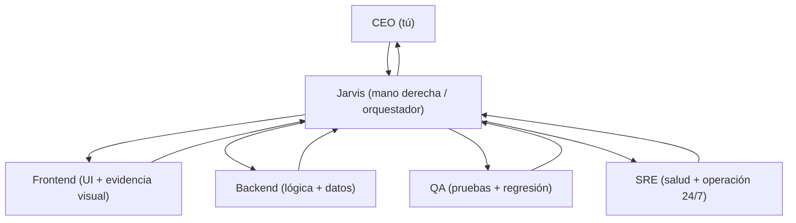

# PonceBot (codexbot) — Jarvis v1

Hablas por Telegram y **Jarvis** (tu mano derecha) decide si es:

- **Consulta**: responde directo (sin delegar, sin spam).
- **Trabajo real**: delega en paralelo a `frontend/backend/qa/sre`, monitorea, y te devuelve un **resumen ejecutivo + evidencias** (patches, artifacts, PNGs).

## Organigrama (Jarvis v1)



## Modo CEO (cómo se usa por Telegram)

- Habla normal: “Jarvis, arma un plan para X” o “¿Qué hace SRE?”.
- Para **forzar** un rol: `@jarvis`, `@frontend`, `@backend`, `@qa`, `@sre`.
- Para ver quién está trabajando y en qué:
  - `/agents` (cola + running por rol)
  - `/ticket <id>` (árbol ticket → subtareas → wrap-up)
  - `/job <id>` (detalle + artifacts)
  - `/dashboard` (PNG del estado del orquestador)

## Equipo (roles) y modelos por default

Fuente de verdad: `orchestrator/agents.yaml` (editable).

| Rol | Enfoque | Modelo | Modo default | Paralelo |
| --- | --- | --- | --- | --- |
| `jarvis` | coordina, responde consultas, delega y hace wrap-up | `gpt-5.2` | `ro` | 1 |
| `frontend` | UI/UX + evidencia visual (HTML/PNG) | `gpt-5.2` | `rw` | 2 |
| `backend` | lógica/servicios/datos/tests | `gpt-5.2` | `rw` | 2 |
| `qa` | pruebas, regresiones, quality gates | `gpt-5.2` | `rw` | 1 |
| `sre` | Site Reliability Engineering: salud, servicios, alertas, operación 24/7 | `gpt-5.2` | `ro` | 1 |

Nota: si tu `codex` CLI no tiene el alias `gpt-5.2`, cambia `model:` en `orchestrator/agents.yaml` (o define tu alias).

## Requisitos

- Python 3 (sin dependencias extra; usa solo stdlib).
- `codex` en `PATH`.
- Para modo local sin OpenAI API: Ollama corriendo en `http://127.0.0.1:11434` (por defecto).
- Salida a Internet desde el servidor hacia `api.telegram.org:443` (polling).

## Setup

1. Crea un bot en Telegram con `@BotFather` y guarda el token.
2. Crea el archivo de config:
   - `cp codexbot.env.example codexbot.env`
   - Edita `codexbot.env` (no se versiona) y deja aquí solo config no-sensible.
   - Secretos (recomendado: fuera del repo/workdir):
     - crea `~/.config/codexbot/secrets.env` con `TELEGRAM_BOT_TOKEN=...` (y otros secretos).
     - exporta `ENV_LOCAL_FILE=$HOME/.config/codexbot/secrets.env` (o configúralo en systemd) para que `run.sh` lo cargue.
   - Alternativa simple: `touch .env.local` en este repo y agrega solo secretos; `run.sh` lo carga automáticamente y no se versiona.
3. Arranca el bot:
   - `./run.sh`
4. En Telegram, escribe cualquier mensaje al bot. Como no esta configurada la allow-list todavia, el bot contestara `Unauthorized` incluyendo `chat_id` y `user_id`.
5. En `codexbot.env`, setea al menos uno:
   - `TELEGRAM_ALLOWED_USER_IDS=123456789`
   - `TELEGRAM_ALLOWED_CHAT_IDS=123456789`
6. Reinicia el bot.

Nota (auth opcional):
- Si `BOT_AUTH_ENABLED=0` (default), el bot no muestra `/login` ni `/logout` en `/help` ni en sugerencias, y respondera `Auth disabled` si los escribes.
- Si `BOT_AUTH_ENABLED=1`, cada chat requiere `/login` (sesion con TTL).

## Uso

- `/help`
- `/whoami`
- `/status`
- `/synccommands` (fuerza re-sincronizacion de sugerencias `/...` en Telegram)
- `/cancel` (cancela el job en curso y descarta los jobs en cola de ese chat)
- `/brief` (resumen ejecutivo corto del estado del orquestador)
- `/new` (inicia un hilo nuevo de Codex para ese chat)
- `/thread` (muestra el `thread_id` actual de Codex para ese chat)
- `/snapshot <url|texto>` (solicita tarea `frontend` de captura visual)
- `/agents` (backlog/estado por rol del orquestador)
- `/dashboard` (snapshot visual del estado del orquestador; PNG)
- `/job <id>` (ver detalle de un job)
- `/ticket <id>` (ver arbol ticket -> subtareas)
- `/inbox [role]` (ver queued/blocked/failed recientes)
- `/runbooks` (ver runbooks y si estan "DUE")
- `/reset_role <role|all>` (resetea memoria/sesion de Codex para ese rol en ese chat)
- `/approve <id>` (desbloquea un job `blocked` que requiere aprobacion)
- `/pause <role>` / `/resume <role>` (control de ejecucion por rol)
- `/skills` (lista skills instaladas, deshabilitadas y `.system`)
- `/skills catalog [filter]` (lista skills instalables desde `openai/skills`)
- `/skills install <skill>` (instala una skill curated en `~/.codex/skills/<skill>`)
- `/skills enable <skill>` (reactiva una skill deshabilitada)
- `/skills disable <skill>` (deshabilita una skill local moviendola a `~/.codex/skills/.disabled/`)
- Texto normal: corre en modo default (`CODEX_DEFAULT_MODE`, recomendado `ro`)
- `/ro <prompt>`: sandbox read-only
- `/rw <prompt>`: sandbox workspace-write (puede editar archivos en `CODEX_WORKDIR`)
- `/full <prompt>`: sandbox danger-full-access (sin sandbox; unsafe)
- Passthrough a Codex: solo `/exec ...`, `/review ...`, `/codex ...` (otros slash commands muestran ayuda)

### Jarvis v1 (Orquestación multiagente)

- Notificaciones (Telegram):
  - Default: `BOT_ORCHESTRATOR_NOTIFY_MODE=minimal` => menos spam: solo tickets top-level, wrap-ups y errores.
  - `verbose` => manda todo (subtasks + logs + mensajes extra de orquestación).
- IDs cortos: `/job`, `/ticket`, `/approve`, `/cancel` aceptan prefijo (ej. `a1b2c3d4`) si es único.
- Evidencia visual (frontend):
  - Si el agente crea `.codexbot_preview/preview.html` en el worktree, el bot genera `preview.png` y lo manda como artifact.
- Consultas vs trabajo:
  - Si Jarvis detecta una **consulta** (pregunta), responde directo (sin delegar).
  - Si quieres **forzar ejecución**, usa verbos tipo “haz/crea/implementa…” o marca `@backend/@frontend/...`.

## Modo "sin limitaciones" (MUY PELIGROSO)

Si quieres que el cliente se conecte "casi directo" a Codex y sin restricciones del bot, habilita:

- `BOT_UNSAFE_DIRECT_CODEX=1`: desactiva la validacion de argv y trata la mayoria de `/<algo>` como `codex <algo> ...`.
- `CODEX_DEFAULT_MODE=full` (o `CODEX_FORCE_FULL_ACCESS=1`): fuerza `--sandbox danger-full-access` por defecto.

Advertencia: con esto, cualquier usuario/chat autorizado puede disparar ejecuciones con acceso total al host
(lectura/escritura fuera del workdir, acceso a archivos locales, etc.). Idealmente corre esto dentro de una VM/container
aislado.

## OSS (Ollama) vs "Codex normal"

- Default: usar tu login/config actual de Codex (OpenAI) via CLI: `CODEX_USE_OSS=0`
- Local (sin OpenAI API): `CODEX_USE_OSS=1` y `CODEX_LOCAL_PROVIDER=ollama`
  - Define `CODEX_OSS_MODEL` (por defecto: `qwen2.5-coder:7b`)

## 24/7

Si tu servidor usa systemd, puedes instalar un servicio con los units en `systemd/`.
Si no, la alternativa simple es correrlo dentro de `tmux`/`screen` o con `nohup`.

### Hardening recomendado (evita "se quedo trabado")

- Usa los units actualizados: incluyen `ExecStartPre` (valida env), `StartLimit*` (evita restart loop infinito) y `OnFailure` (manda alerta fuera del proceso del bot).
- Configura un chat de alertas:
  - en Telegram corre `/setnotify` (guarda `notify_chat_id`), o
  - fija `TELEGRAM_NOTIFY_CHAT_ID=<tu_chat_id>` en `codexbot.env`.
- Prueba la ruta de alerta:
  - `systemctl --user start codexbot-alert-user@codexbot.service`
  - Debe llegarte un mensaje al chat de notificacion.
- Si arrancas manualmente con `./run.sh`, valida antes con:
  - `./run.sh --check-env`

## Notas

- Por default, el bot drena (descarta) updates pendientes al iniciar para evitar re-ejecutar backlog despues de un restart: `BOT_DRAIN_UPDATES_ON_START=1`.
- Por default, el bot mantiene un "hilo" por chat usando sesiones nativas de Codex CLI (`codex exec resume`). Para reiniciar el hilo: `/new`.
- Si queres que el bot sea casi transparente (sin parsing de comandos del bot) habilita `BOT_STRICT_PROXY=1`. En ese modo, casi todo el texto se reenvia directo a Codex, y solo quedan `/new`, `/thread`, `/cancel`.
- Si quieres evitar que un flood llene la memoria, puedes limitar la cola: `BOT_QUEUE_MAXSIZE=100` (0 = sin limite).
- Puedes limitar la cola por chat con `BOT_MAX_QUEUED_PER_CHAT=1` y habilitar heartbeat con `BOT_HEARTBEAT_SECONDS=60`.
- Si la respuesta final es muy larga, puede enviarse como archivo `.txt` (controlado por `BOT_SEND_AS_FILE_THRESHOLD_CHARS`).
- Formato en Telegram: por defecto usa `BOT_TELEGRAM_PARSE_MODE=HTML` para renderizar `code` y fences ```...``` correctamente.
- Puedes mandar imagenes al bot (foto o documento de tipo imagen). El bot las descarga y las pasa a Codex como `--image`.
  - Prompt: usa el caption si lo mandas; si no, usa un prompt default.
  - Limite de descarga: `BOT_MAX_DOWNLOAD_BYTES` (0 = sin limite).
- Puedes mandar notas de voz / audio y transcribirlas a texto:
  - Habilita `BOT_TRANSCRIBE_AUDIO=1`.
  - Recomendado (gratis/local): `BOT_TRANSCRIBE_BACKEND=whispercpp`.
    - Requiere: `ffmpeg`, `whisper-cli` (whisper.cpp) y un modelo ggml (ej. `ggml-small.bin`).
    - Instalacion rapida (Ubuntu x86_64, sin sudo; instala binarios dentro del repo y mantenlos en `.gitignore`):

      ```bash
      cd /home/aponce/codexbot
      mkdir -p bin models vendor

      # ffmpeg estatico
      cd vendor
      curl -L -o ffmpeg.tar.xz https://johnvansickle.com/ffmpeg/releases/ffmpeg-release-amd64-static.tar.xz
      tar -xf ffmpeg.tar.xz
      cp ffmpeg-*-amd64-static/ffmpeg ../bin/ffmpeg
      chmod +x ../bin/ffmpeg
      cd ..

      # whisper.cpp (build)
      git clone https://github.com/ggerganov/whisper.cpp vendor/whisper.cpp

      # CMake (sin sudo)
      python3 -m venv vendor/.venv-cmake
      vendor/.venv-cmake/bin/pip install --upgrade pip cmake
      vendor/.venv-cmake/bin/cmake -S vendor/whisper.cpp -B vendor/whisper.cpp/build -DCMAKE_BUILD_TYPE=Release
      vendor/.venv-cmake/bin/cmake --build vendor/whisper.cpp/build -j 8

      cp vendor/whisper.cpp/build/bin/whisper-cli bin/whisper-cli
      chmod +x bin/whisper-cli

      # modelo (small)
      bash vendor/whisper.cpp/models/download-ggml-model.sh small
      cp vendor/whisper.cpp/models/ggml-small.bin models/ggml-small.bin
      ```

    - Env recomendado:
      - `BOT_TRANSCRIBE_FFMPEG_BIN=/home/aponce/codexbot/bin/ffmpeg`
      - `BOT_TRANSCRIBE_WHISPERCPP_BIN=/home/aponce/codexbot/bin/whisper-cli`
      - `BOT_TRANSCRIBE_WHISPERCPP_MODEL_PATH=/home/aponce/codexbot/models/ggml-small.bin`
  - Alternativa (API): `BOT_TRANSCRIBE_BACKEND=openai` + `OPENAI_API_KEY`.
    Nota: esto tiene costo por uso y no viene incluido por tener suscripcion de ChatGPT.
  - El texto transcrito se procesa igual que si lo hubieras escrito (incluye /ro /rw /exec, etc.).

## Plan de implementación (v1)

### 1) Certezas del estado actual

Lo siguiente está implementado en este repo:

- Orquestación multirol persistente (SQLite):
  - `orchestrator/storage.py` con `jobs`, `job_events`, `role_controls`, `approver_log`.
  - `parent_job_id` + `depends_on` para arbol ticket -> subtareas y gating de dependencias.
- Agentes reales por rol:
  - `orchestrator/agents.yaml` define `system_prompt`, `model`, `effort`, `mode_hint`, `max_parallel_jobs`.
  - `orchestrator/prompting.py` inyecta `system_prompt` + contrato JSON de salida en cada prompt.
- Memoria por rol+chat (sesiones Codex):
  - Tabla `agent_sessions` guarda `thread_id` por `(chat_id, role)`.
  - El runner usa `codex exec resume <thread_id>` cuando `BOT_ORCH_SESSIONS_ENABLED=1`.
  - `/reset_role <role|all>` limpia sesiones por chat.
- Aislamiento de codigo (git worktrees por rol/slot):
  - Tabla `workspace_leases` evita colisiones entre workers.
  - `orchestrator/workspaces.py` crea y limpia pool de worktrees bajo `BOT_WORKTREE_ROOT`.
  - Se generan evidencias por job en `BOT_ARTIFACTS_ROOT/<job_id>/`:
    - `changes.patch` (git diff)
    - `git_status.txt`
- Delegación de Jarvis:
  - Cuando un job `jarvis` top-level termina, se parsea su JSON (`subtasks`) y se encolan child jobs con `parent_job_id=ticket_id`.
  - Se agenda un job adicional de `jarvis` tipo "wrap-up" que depende de todas las subtareas y manda un brief final.
- Persistencia de resultados (memoria operativa):
  - Al finalizar un job, se guarda un resumen estructurado en `jobs.trace` (`result_summary`, `result_artifacts`, `result_duration_s`, etc).
  - `/job <id>` y `/ticket <id>` muestran esos resultados sin depender solo del chat.
- Voz usable (ACK rapido + transcripcion async):
  - Con `BOT_TRANSCRIBE_AUDIO=1` + `BOT_TRANSCRIBE_ASYNC=1`, el bot responde ACK rapido y transcribe en background.
- Capturas reales (`/snapshot`):
  - Si `BOT_SCREENSHOT_ENABLED=1` y Playwright está instalado, `/snapshot <url>` captura `snapshot.png` y lo envia como artifact.
  - Guardrails anti-SSRF: por defecto bloquea destinos privados/reservados y esquemas no-http(s). Para forzar un caso bloqueado: `/approve <job_id>`.
- Runbooks (autonomia):
  - `orchestrator/runbooks.yaml` + scheduler cada 60s encola tareas autonomas si estan "DUE".
  - `/runbooks` muestra estado (last run y DUE).

### 2) Supuestos (a validar en entorno real)

- Se asume acceso estable al host de operación (`100.93.21.71` por Tailscale) y acceso SSH ya resuelto.
- Se asume disponibilidad de `gpt-5.2` (o alias estable configurable).
- Se asume capacidad de correr múltiples procesos `codex` en paralelo sin saturar recursos.
- Para `/snapshot`: se asume Playwright instalado en el entorno Python del servidor (opcional; solo si `BOT_SCREENSHOT_ENABLED=1`).

### 3) Fases y alcance inmediato (próximos pasos)

- **Fase 1 — Entrega actual (v1 base):**
  - Ticket Jarvis -> subtareas por rol (delegación) con estado por job.
  - Memoria por rol (Codex resume) y worktrees aislados.
  - Voz async con ACK, runbooks y snapshots (si se habilita).
- **Fase 2 — Operación autónoma real (a completar):**
  - Auto-revisión de tareas por rol.
  - Controles de cuota/tiempo por rol.
  - Endurecer politicas de riesgo (deploy/push) y approvals por tipo de accion.
  - Kill-switch (`/emergency_stop`) y reglas de gobernanza más finas.

### 4) Configuración clave del orquestador

- `BOT_ORCHESTRATOR_ENABLED`
- `BOT_ORCHESTRATOR_DB_PATH`
- `BOT_ORCHESTRATOR_DAILY_DIGEST_SECONDS`
- `BOT_ORCHESTRATOR_DEFAULT_ROLE`
- `BOT_ORCHESTRATOR_DEFAULT_PRIORITY`
- `BOT_ORCHESTRATOR_DEFAULT_MAX_COST_WINDOW_USD`
- `BOT_ORCHESTRATOR_AGENT_PROFILES`
- `BOT_SCREENSHOT_ENABLED`
- `BOT_SCREENSHOT_ALLOWED_HOSTS`
- `ENV_LOCAL_FILE` (ruta a secretos fuera del repo/workdir)

### 5) Puesta en marcha recomendada

1. Secretos fuera del repo/workdir:
   - Recomendada: `~/.config/codexbot/secrets.env` (permiso `600`) con `TELEGRAM_BOT_TOKEN=...` (y opcional `OPENAI_API_KEY=...`).
   - En `systemd --user` (unit `codexbot.service`): setea `Environment=ENV_LOCAL_FILE=%h/.config/codexbot/secrets.env`.
2. Arranca y valida:
   - `./run.sh --check-env`
   - `./run.sh`
3. Verifica:
   - `/status`
   - `/agents`
   - `/job <id>` tras enviar un comando de texto.
